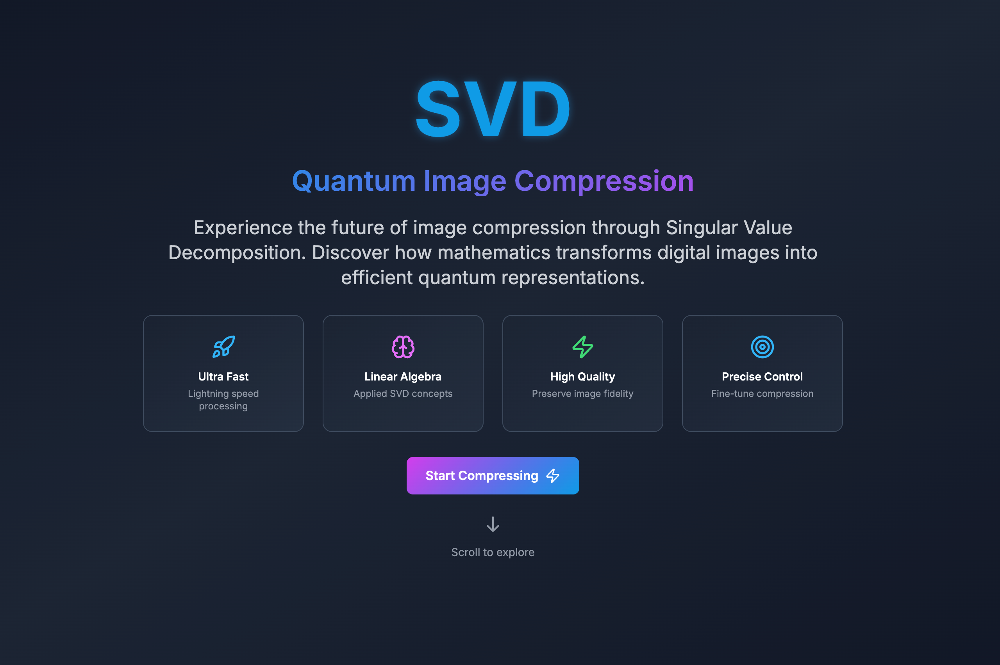
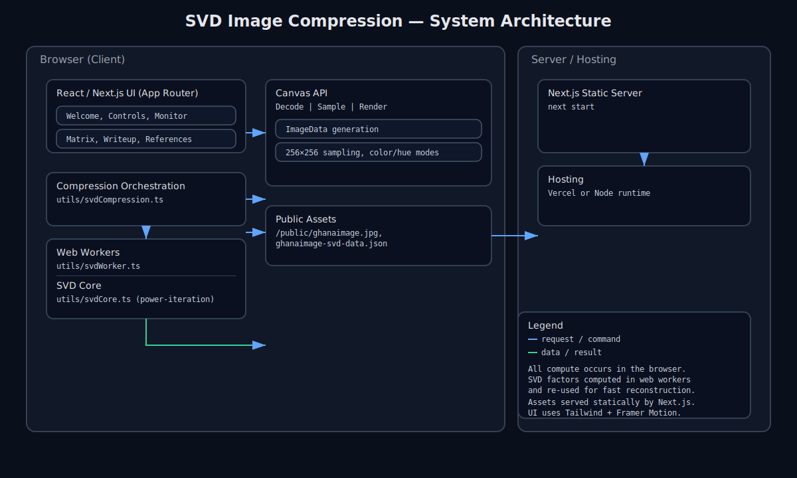

<div align="center">

# SVD Image Compression

**MATH 3120 Final Project - Advanced Singular Value Decomposition for Intelligent Image Compression**

[](https://www.upenn.edu/)
[](https://www.seas.upenn.edu/)
[](https://www.math.upenn.edu/)
[](https://opensource.org/licenses/MIT)
[](https://www.typescriptlang.org/)
[](https://reactjs.org/)
[](https://nextjs.org/)
[](https://www.python.org/)

**Final Project for MATH 3120: Numerical Linear Algebra**  
**University of Pennsylvania, School of Engineering and Applied Science**  
**Fall 2024 - Computer Engineering**

_An academic exploration of Singular Value Decomposition applied to image compression. This final project demonstrates the practical applications of numerical linear algebra concepts learned in MATH 3120, combining advanced mathematical theory with modern web technologies for interactive educational visualization._

</div>

## Table of Contents

- [Academic Project Overview](#academic-project-overview)
  - [Course Context](#course-context)
  - [Academic Objectives](#academic-objectives)
  - [Project Scope](#project-scope)
- [Features](#features)
- [Tech Stack](#tech-stack)
- [Screenshots](#screenshots)
- [Quick Start](#quick-start)
- [Installation](#installation)
  - [Prerequisites](#prerequisites)
  - [Frontend Setup](#frontend-setup)
  - [Backend Setup](#backend-setup)
  - [Configuration](#configuration)
- [Usage](#usage)
  - [Web Interface](#web-interface)
  - [Compression Settings](#compression-settings)
  - [Performance Monitoring](#performance-monitoring)
- [Architecture](#architecture)
- [Mathematical Foundation](#mathematical-foundation)
- [API Documentation](#api-documentation)
- [Educational Content](#educational-content)
- [Limitations](#limitations)
- [Roadmap](#roadmap)
- [Contributing](#contributing)
- [Academic License and Usage](#academic-license-and-usage)
- [Academic Acknowledgments](#academic-acknowledgments)
- [Support](#support)

## Academic Project Overview

This project represents the culmination of learning in **MATH 3120: Numerical Linear Algebra** at the University of Pennsylvania. As a final project for the course, it demonstrates the practical application of Singular Value Decomposition (SVD) concepts taught throughout the semester, specifically applied to the domain of image compression.

### Course Context

**MATH 3120: Numerical Linear Algebra** covers fundamental concepts in computational linear algebra, including:
- Matrix decompositions (SVD, QR, LU)
- Eigenvalue and eigenvector computations
- Numerical stability and error analysis
- Applications to data science and engineering

This final project synthesizes these concepts into a comprehensive web application that demonstrates the power of SVD in image compression, making abstract mathematical concepts tangible through interactive visualization.

### Academic Objectives

The project serves multiple educational purposes:
- **Practical Application**: Implementing SVD algorithms learned in class
- **Real-world Relevance**: Demonstrating how linear algebra applies to image processing
- **Technical Skills**: Combining mathematical theory with modern software development
- **Educational Value**: Creating an interactive tool for understanding SVD concepts

### Project Scope

This academic project goes beyond traditional coursework by:
- Building a full-stack web application with mathematical computing backend
- Implementing real-time SVD processing with performance monitoring
- Creating educational content that explains the mathematical foundation
- Providing interactive visualizations for better concept understanding
- Demonstrating professional software development practices

## Features

### Core Compression Capabilities

- **Real-time SVD Processing**: Live decomposition with visual progress tracking
- **Interactive Parameter Control**: Adjustable rank, quality, and color mix settings
- **Multi-channel Processing**: Separate RGB channel processing for optimal compression
- **Performance Monitoring**: Real-time metrics including processing time and compression ratios
- **Quality Assessment**: Built-in quality scoring and visual comparison tools

### Advanced Web Interface

- **Interactive Upload**: Drag-and-drop file upload with instant preview
- **Real-time Processing**: Animated progress rings and live status updates
- **Parameter Sliders**: Intuitive controls for rank, quality, and color adjustments
- **Visual Feedback**: Dynamic progress indicators and performance metrics
- **Responsive Design**: Mobile-friendly interface built with React and Tailwind CSS

### Educational Components

- **Mathematical Foundation**: Comprehensive SVD theory and implementation guides
- **Interactive Visualizations**: Step-by-step decomposition process demonstrations
- **Compression Comparison**: Side-by-side original vs compressed image analysis
- **Performance Analytics**: Detailed metrics and optimization insights
- **Educational Content**: In-depth explanations of linear algebra concepts

### Error Handling & Performance

- **Graceful Error Recovery**: Comprehensive error boundaries and user feedback
- **Performance Monitoring**: Real-time processing metrics and optimization
- **Memory Management**: Efficient handling of large image files
- **Cross-browser Compatibility**: Optimized for modern web browsers

## Tech Stack

<div align="center">

### Frontend


### Backend


### Mathematical Libraries


## Screenshots

### Main Interface

_Professional web interface with interactive compression controls and real-time processing_



### Compression Settings

_Advanced parameter controls for fine-tuning compression quality and performance_


### Performance Monitoring

_Real-time performance metrics and processing analytics dashboard_


### Educational Content

_Comprehensive mathematical foundation and SVD computation guides_


### Compression Comparison

_Side-by-side analysis of original vs compressed images with quality metrics_


### System Architecture

_Comprehensive architecture overview showing all system components_



## Quick Start

Get up and running in under 5 minutes:

```bash
# Clone the repository
git clone https://github.com/tmarhguy/svd.git
cd svd

# Frontend setup
cd apps/web
npm install
npm run dev

# Backend setup (in another terminal)
cd apps/api
pip install -r requirements.txt
python main.py
```

## Installation

### Prerequisites

- **Node.js 16+** - [Download](https://nodejs.org/)
- **Python 3.9+** - [Download](https://www.python.org/downloads/)
- **Modern Web Browser** - Chrome, Firefox, Safari, or Edge

### Frontend Setup

<details>
<summary>Click to expand detailed frontend setup</summary>

1. **Clone and navigate to the project:**

   ```bash
   git clone https://github.com/tmarhguy/svd.git
   cd svd/apps/web
   ```

2. **Install dependencies:**

   ```bash
   npm install
   ```

3. **Start development server:**

   ```bash
   npm run dev
   ```

4. **Verify installation:**
   Navigate to `http://localhost:3000`

</details>

### Backend Setup

<details>
<summary>Click to expand detailed backend setup</summary>

1. **Navigate to backend directory:**

   ```bash
   cd apps/api
   ```

2. **Create virtual environment:**

   ```bash
   python -m venv venv
   source venv/bin/activate  # On Windows: venv\Scripts\activate
   ```

3. **Install dependencies:**

   ```bash
   pip install -r requirements.txt
   ```

4. **Start API server:**

   ```bash
   python main.py
   ```

5. **Verify installation:**
   Navigate to `http://localhost:8000/docs`

</details>

### Configuration

The application uses default configurations optimized for most use cases. For advanced users:

1. **Environment variables** (optional):

   ```bash
   # Frontend (.env.local)
   NEXT_PUBLIC_API_URL=http://localhost:8000

   # Backend (.env)
   MAX_FILE_SIZE=10485760  # 10MB
   ALLOWED_EXTENSIONS=jpg,jpeg,png,bmp
   ```

2. **Performance tuning**:
   ```bash
   # Backend settings
   WORKER_PROCESSES=4
   CHUNK_SIZE=1024
   ```

## Usage

### Web Interface

1. **Upload Image:**

   - Drag and drop an image file or click to browse
   - Supported formats: JPG, PNG, BMP
   - Maximum file size: 10MB

2. **Adjust Compression Settings:**

   - **Rank Slider**: Control the number of singular values (1-100)
   - **Quality Slider**: Fine-tune compression quality (0-100)
   - **Color Mix**: Adjust color channel processing

3. **Monitor Processing:**

   - Real-time progress indicators
   - Performance metrics display
   - Processing time tracking

4. **Review Results:**
   - Side-by-side comparison
   - Quality metrics
   - Download compressed image

### Compression Settings

<details>
<summary>Click to expand compression parameter details</summary>

**Rank Parameter:**

- Controls the number of singular values used in reconstruction
- Lower values = higher compression, lower quality
- Higher values = lower compression, higher quality
- Recommended range: 10-50 for most images

**Quality Parameter:**

- Fine-tunes the compression algorithm
- Affects both file size and visual quality
- Works in conjunction with rank parameter
- Real-time preview of changes

**Color Mix:**

- Adjusts processing of RGB channels
- Can optimize for specific color characteristics
- Useful for images with dominant color themes

</details>

### Performance Monitoring

<details>
<summary>Click to expand performance monitoring details</summary>

**Real-time Metrics:**

- Processing time (milliseconds)
- Memory usage
- Compression ratio
- Quality score

**Performance Indicators:**

- Color-coded metrics (green/yellow/red)
- Performance score (0-100)
- Animated progress bars
- Processing status updates

</details>

## Architecture

<div align="center">


</div>

### Core Components

- **Frontend**: React-based SPA with TypeScript and Tailwind CSS
- **Backend API**: FastAPI server with Python image processing
- **SVD Engine**: NumPy-powered matrix decomposition
- **Image Processing**: Pillow-based image manipulation
- **Performance Monitor**: Real-time metrics and analytics
- **Error Handling**: Comprehensive error boundaries and recovery

### Data Flow

1. **Image Upload**: Client-side file validation and preview
2. **API Processing**: Server-side SVD decomposition
3. **Real-time Updates**: WebSocket-like progress tracking
4. **Result Delivery**: Compressed image and metadata
5. **Performance Analytics**: Metrics collection and display

## Mathematical Foundation

### Singular Value Decomposition (SVD)

SVD decomposes a matrix A into three components:

```
A = UΣV^T
```

Where:

- **U**: Left singular vectors (orthogonal matrix)
- **Σ**: Singular values (diagonal matrix)
- **V^T**: Right singular vectors (orthogonal matrix)

### Image Compression Process

1. **Matrix Representation**: Convert image to numerical matrix
2. **SVD Decomposition**: Factorize matrix using SVD
3. **Rank Reduction**: Keep only k largest singular values
4. **Reconstruction**: Rebuild image from reduced components
5. **Quality Assessment**: Compare original vs compressed

### Compression Ratio

```
Compression Ratio = (Original Size - Compressed Size) / Original Size × 100%
```

### Quality Metrics

- **Peak Signal-to-Noise Ratio (PSNR)**
- **Structural Similarity Index (SSIM)**
- **Mean Squared Error (MSE)**

## API Documentation

The backend provides comprehensive REST API documentation:

- **Interactive Docs**: `http://localhost:8000/docs`
- **ReDoc**: `http://localhost:8000/redoc`

### Key Endpoints

| Endpoint               | Method | Description                  |
| ---------------------- | ------ | ---------------------------- |
| `/upload`              | POST   | Upload image for compression |
| `/compress`            | POST   | Perform SVD compression      |
| `/status/{session_id}` | GET    | Check processing status      |
| `/download/{file_id}`  | GET    | Download compressed image    |
| `/metrics`             | GET    | Get performance metrics      |

### Request/Response Examples

<details>
<summary>Click to expand API examples</summary>

**Upload Image:**

```bash
curl -X POST "http://localhost:8000/upload" \
  -H "Content-Type: multipart/form-data" \
  -F "file=@image.jpg"
```

**Compress Image:**

```bash
curl -X POST "http://localhost:8000/compress" \
  -H "Content-Type: application/json" \
  -d '{
    "file_id": "abc123",
    "rank": 25,
    "quality": 85
  }'
```

**Get Status:**

```bash
curl -X GET "http://localhost:8000/status/abc123"
```

</details>

## Educational Content

### Interactive Learning Modules

- **What is an Image?**: Digital pixel theory and color channels
- **How Computers See Images**: Matrix representation and processing
- **SVD Mathematics**: Step-by-step decomposition process
- **Compression Comparison**: Visual analysis tools
- **Real-world Applications**: Industry use cases and examples

### Mathematical Concepts Covered

- **Linear Algebra**: Matrix operations and transformations
- **Eigenvalues/Eigenvectors**: Fundamental concepts
- **Orthogonal Matrices**: Properties and applications
- **Numerical Methods**: Efficient computation techniques
- **Error Analysis**: Quality assessment methods

### Interactive Features

- **Step-by-step Guides**: Detailed SVD computation process
- **Visual Demonstrations**: Animated matrix transformations
- **Parameter Exploration**: Real-time parameter adjustment
- **Quality Assessment**: Built-in comparison tools
- **Performance Analytics**: Detailed metrics and insights

## Limitations

### Current Constraints

- **File Size**: Maximum 10MB per image
- **Format Support**: JPG, PNG, BMP formats only
- **Processing Time**: Large images may take several seconds
- **Browser Compatibility**: Modern browsers required
- **Memory Usage**: Large images require significant memory

### Known Issues

- **Very Large Images**: May cause browser memory issues
- **Complex Textures**: Some textures may not compress well
- **Color Accuracy**: Slight color shifts possible with high compression
- **Processing Limits**: Server-side rate limiting for stability

## Roadmap

### Upcoming Features

- [ ] **Batch Processing**: Multiple image compression
- [ ] **Advanced Formats**: Support for TIFF, WebP, AVIF
- [ ] **Cloud Storage**: Integration with cloud services
- [ ] **Mobile App**: Native iOS/Android applications
- [ ] **AI Enhancement**: Machine learning for parameter optimization
- [ ] **Video Compression**: Extend to video processing
- [ ] **Real-time Streaming**: Live compression for video calls

### Technical Improvements

- [ ] **WebAssembly**: Faster client-side processing
- [ ] **GPU Acceleration**: CUDA/OpenCL support
- [ ] **Progressive Loading**: Better large file handling
- [ ] **Caching System**: Improved performance for repeated operations
- [ ] **Advanced Analytics**: Detailed compression statistics
- [ ] **Export Options**: Multiple output format support

### Educational Enhancements

- [ ] **Interactive Tutorials**: Step-by-step learning modules aligned with MATH 3120 curriculum
- [ ] **Mathematical Visualizations**: Enhanced SVD demonstrations for educational purposes
- [ ] **Comparison Tools**: Advanced before/after analysis for academic study
- [ ] **Performance Benchmarks**: Computational complexity analysis for course assignments
- [ ] **Research Integration**: Academic paper references and course material connections
- [ ] **Assignment Extensions**: Additional problem sets based on the implementation
- [ ] **Lecture Integration**: Materials suitable for classroom demonstration

## Contributing

We welcome contributions! Here's how to get started:

<details>
<summary>Click to expand contribution guidelines</summary>

### Quick Contribution Guide

1. **Fork the repository**
2. **Create a feature branch:**
   ```bash
   git checkout -b feature/amazing-feature
   ```
3. **Make your changes and test thoroughly**
4. **Commit with conventional commits:**
   ```bash
   git commit -m "feat: add amazing new feature"
   ```
5. **Push to your fork and create a Pull Request**

### Development Setup

```bash
# Clone your fork
git clone https://github.com/yourusername/svd.git

# Install dependencies
cd apps/web && npm install
cd ../api && pip install -r requirements.txt

# Run development servers
cd ../web && npm run dev
cd ../api && python main.py
```

### Code Standards

- **TypeScript**: Strict mode, comprehensive typing
- **Python**: PEP 8, type hints, docstrings
- **Testing**: Maintain >80% code coverage
- **Documentation**: Update README for new features
- **Performance**: Optimize for large image processing

### Areas for Contribution

- **Frontend**: React components, UI/UX improvements
- **Backend**: API endpoints, image processing algorithms
- **Documentation**: Tutorials, mathematical explanations
- **Testing**: Unit tests, integration tests
- **Performance**: Optimization, caching strategies

</details>

## Academic License and Usage

This project is licensed under the **MIT License** - see the [LICENSE](LICENSE) file for details.

### Academic Context

**Important Note:** This is an academic final project for MATH 3120: Numerical Linear Algebra at the University of Pennsylvania. While the code is open source under MIT License, this work represents original academic effort for course requirements.

### Academic Integrity

- This project represents original work completed for MATH 3120 final project requirements
- All mathematical concepts are based on course materials and standard numerical linear algebra texts
- Implementation follows academic best practices for educational software development
- Code is shared for educational purposes and portfolio demonstration

### License Terms

- ✅ Commercial use allowed (post-graduation)
- ✅ Modification allowed for learning purposes
- ✅ Distribution allowed with attribution
- ✅ Private use allowed
- ❌ Liability and warranty not provided
- ⚠️ **Academic Use**: Please provide appropriate citation if used for educational purposes

### Citation

If you use this project for academic purposes, please cite as:

```
Marhguy, T. (2024). SVD Image Compression: A Numerical Linear Algebra Approach. 
Final Project for MATH 3120: Numerical Linear Algebra. 
University of Pennsylvania, School of Engineering and Applied Science.
https://github.com/tmarhguy/svd
```

## Academic Acknowledgments

### Course and Institution

- **MATH 3120: Numerical Linear Algebra** - Course framework and mathematical foundation
- **University of Pennsylvania, School of Engineering and Applied Science** - Academic support and resources
- **Department of Mathematics** - Theoretical background and course materials
- **Computer Engineering Program** - Technical skills and software development training

### Academic Contributors

- **Course Instructor** - Guidance on numerical linear algebra concepts and SVD theory
- **Teaching Assistants** - Support with mathematical implementations and debugging
- **Classmates and Study Groups** - Collaborative learning and concept discussions
- **Academic Advisors** - Project guidance and educational goal alignment

### Technical Acknowledgments

- **NumPy/SciPy**: Fundamental numerical computing libraries used in course
- **React/Next.js**: Modern web development frameworks for educational visualization
- **FastAPI**: High-performance backend for mathematical computations
- **Tailwind CSS**: Professional UI framework for academic presentation
- **University Computing Resources**: Development and testing infrastructure

### Educational Resources

- **Course Textbooks and Materials**: Theoretical foundation for SVD implementation
- **Academic Papers**: Research references for advanced compression techniques
- **Online Educational Platforms**: Supplementary learning materials
- **Open Source Community**: Educational tools and mathematical libraries

## Support & Community

<div align="center">

### Need Help?

[](https://github.com/tmarhguy/svd/issues)
[](https://github.com/tmarhguy/svd/discussions)

**Quick Links:**

- [Report Bug](https://github.com/tmarhguy/svd/issues/new?template=bug_report.md)
- [Request Feature](https://github.com/tmarhguy/svd/issues/new?template=feature_request.md)
- [View Documentation](https://github.com/tmarhguy/svd/wiki)
- [Join Discussion](https://github.com/tmarhguy/svd/discussions)

### Student Information

**Student:** Tyrone Marhguy  
**University Email:** tmarhguy@seas.upenn.edu  
**Course:** MATH 3120 - Numerical Linear Algebra (Final Project)  
**University:** University of Pennsylvania, School of Engineering and Applied Science  
**Major:** Computer Engineering, Class of 2028  
**Semester:** Fall 2024  
**Project Type:** Final Course Project - Numerical Linear Algebra Applications

### Social Links

- [LinkedIn](https://linkedin.com/in/tyrone-marhguy)
- [GitHub](https://github.com/tmarhguy)
- [Portfolio](https://tmarhguy.github.io/tmarhguy)
- [Instagram](https://instagram.com/tyrone_marhguy)
- [Twitter](https://twitter.com/marhguy_tyrone)

</div>

---

<div align="center">

**⭐ Star this repository if you found this MATH 3120 final project helpful! ⭐**

_Academic Final Project by [Tyrone Marhguy](https://github.com/tmarhguy) for MATH 3120: Numerical Linear Algebra_  
_University of Pennsylvania, School of Engineering and Applied Science_  
_Fall 2024 - Computer Engineering Class of 2028_

</div>
