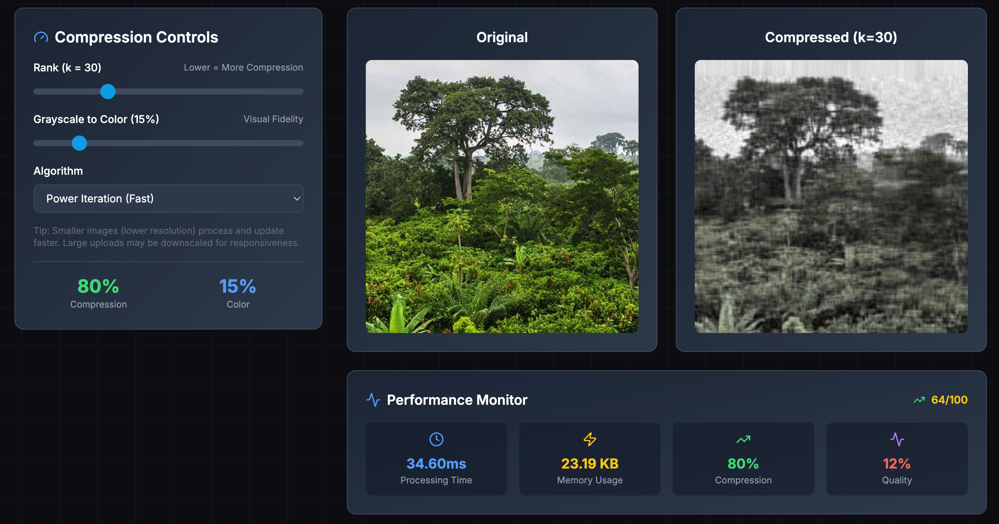

<div align="center">

# SVD Image Compression

**MATH 3120 Final Project - Advanced Singular Value Decomposition for Intelligent Image Compression**

[](https://www.upenn.edu/)
[](https://www.seas.upenn.edu/)
[](https://www.math.upenn.edu/)
[](https://opensource.org/licenses/MIT)
[](https://www.typescriptlang.org/)
[](https://reactjs.org/)
[](https://nextjs.org/)

**Final Project for MATH 3120: Numerical Linear Algebra**  
**University of Pennsylvania, School of Engineering and Applied Science**  
**Fall 2024 - Computer Engineering**

_A client-side web application demonstrating real-time SVD image compression. This final project showcases the practical applications of numerical linear algebra concepts learned in MATH 3120, combining advanced mathematical theory with modern web technologies for interactive educational visualization._

**Live Demo:** https://svd-wheat.vercel.app/

</div>

## Table of Contents

- [Academic Project Overview](#academic-project-overview)
  - [Course Context](#course-context)
  - [Academic Objectives](#academic-objectives)
  - [Project Scope](#project-scope)
- [Features](#features)
- [Tech Stack](#tech-stack)
- [Screenshots](#screenshots)
- [Quick Start](#quick-start)
- [Installation](#installation)
  - [Prerequisites](#prerequisites)
  - [Setup](#setup)
  - [Configuration](#configuration)
- [Deployment](#deployment)
  - [Deploy to Vercel](#deploy-to-vercel-recommended)
  - [Other Deployment Options](#other-deployment-options)
- [Usage](#usage)
  - [Web Interface](#web-interface)
  - [Compression Settings](#compression-settings)
  - [Performance Monitoring](#performance-monitoring)
- [Architecture](#architecture)
- [Mathematical Foundation](#mathematical-foundation)
- [Educational Content](#educational-content)
- [Limitations](#limitations)
- [Contributing](#contributing)
- [Academic License and Usage](#academic-license-and-usage)
- [Academic Acknowledgments](#academic-acknowledgments)
- [Support](#support)
- [Performance Optimizations](#performance-optimizations)

## Academic Project Overview

This project represents the culmination of learning in **MATH 3120: Numerical Linear Algebra** at the University of Pennsylvania. As a final project for the course, it demonstrates the practical application of Singular Value Decomposition (SVD) concepts taught throughout the semester, specifically applied to the domain of image compression.

### Course Context

**MATH 3120: Numerical Linear Algebra** covers fundamental concepts in computational linear algebra, including:

- Matrix decompositions (SVD, QR, LU)
- Eigenvalue and eigenvector computations
- Numerical stability and error analysis
- Applications to data science and engineering

This final project synthesizes these concepts into a comprehensive web application that demonstrates the power of SVD in image compression, making abstract mathematical concepts tangible through interactive visualization.

### Academic Objectives

The project serves multiple educational purposes:

- **Practical Application**: Implementing SVD algorithms learned in class
- **Real-world Relevance**: Demonstrating how linear algebra applies to image processing
- **Technical Skills**: Combining mathematical theory with modern software development
- **Educational Value**: Creating an interactive tool for understanding SVD concepts

### Project Scope

This academic project goes beyond traditional coursework by:

- Building a client-side web application with browser-based mathematical computing
- Implementing real-time SVD processing with performance monitoring
- Creating educational content that explains the mathematical foundation
- Providing interactive visualizations for better concept understanding
- Demonstrating professional software development practices

## Features

### Core Compression Capabilities

- **Real-time SVD Processing**: Live decomposition with visual progress tracking
- **Interactive Parameter Control**: Adjustable rank, quality, and color mix settings
- **Multi-channel Processing**: Separate RGB channel processing for optimal compression
- **Performance Monitoring**: Real-time metrics including processing time and compression ratios
- **Quality Assessment**: Built-in quality scoring and visual comparison tools

### Advanced Web Interface

- **Interactive Upload**: Drag-and-drop file upload with instant preview
- **Real-time Processing**: Animated progress rings and live status updates
- **Parameter Sliders**: Intuitive controls for rank, quality, and color adjustments
- **Visual Feedback**: Dynamic progress indicators and performance metrics
- **Responsive Design**: Mobile-friendly interface built with React and Tailwind CSS

### Educational Components

- **Mathematical Foundation**: Comprehensive SVD theory and implementation guides
- **Interactive Visualizations**: Step-by-step decomposition process demonstrations
- **Compression Comparison**: Side-by-side original vs compressed image analysis
- **Performance Analytics**: Detailed metrics and optimization insights
- **Educational Content**: In-depth explanations of linear algebra concepts

### Error Handling & Performance

- **Graceful Error Recovery**: Comprehensive error boundaries and user feedback
- **Performance Monitoring**: Real-time processing metrics and optimization
- **Memory Management**: Efficient handling of large image files
- **Cross-browser Compatibility**: Optimized for modern web browsers

## Tech Stack

<div align="center">

### Frontend


### Core Processing


### Mathematical Libraries


</div>

## Screenshots

_For detailed information about each screenshot, see [screenshots/README.md](screenshots/README.md)_

### Main Interface

_The main application interface showcasing the interactive SVD image compression tool with the welcome section, image upload area, and primary navigation. Features the professional sci-fi themed design with matrix rain effects and holographic styling that creates an engaging educational experience for MATH 3120 students._


### Matrix Visualization

_Interactive matrix representation showing how images are converted to numerical matrices for SVD processing. This educational visualization helps MATH 3120 students understand the fundamental concept of representing visual data as mathematical matrices, demonstrating the bridge between linear algebra theory and practical image processing._


### Performance Analytics

_Real-time performance monitoring dashboard displaying compression metrics, processing time, memory usage, and quality assessments. This interface provides students with insights into the computational complexity and efficiency of SVD algorithms, directly connecting to the numerical analysis concepts covered in MATH 3120._



### Interactive Quiz

_Educational quiz interface designed to test student understanding of SVD concepts and image compression principles. This interactive learning tool reinforces the mathematical concepts taught in MATH 3120 through engaging questions about singular value decomposition, matrix decomposition, and compression theory._


### System Architecture

Comprehensive system architecture showing client-side structure, data flow, and component relationships.


### Compression Comparison Visualization

_Interactive SVG visualization comparing original and compressed images with detailed metrics and mathematical analysis. This dynamic diagram illustrates the effectiveness of different SVD rank approximations and provides visual feedback on compression quality, perfect for understanding the trade-offs in numerical linear algebra applications._


## Quick Start

Get up and running in under 2 minutes:

```bash
# Clone the repository
git clone https://github.com/tmarhguy/svd.git
cd svd

# Install dependencies and start
npm install
npm run dev

# Open your browser to http://localhost:3000
```

Note: if your clone contains this app within a subfolder (e.g., `svd/compression-svd`), run `cd svd/compression-svd` instead of `cd svd`.

```bash

```

## Installation

### Prerequisites

- **Node.js 20.x** - [Download](https://nodejs.org/)
- **Modern Web Browser** - Chrome, Firefox, Safari, or Edge

### Setup

<details>
<summary>Click to expand detailed setup instructions</summary>

1. **Clone and navigate to the project:**

   ```bash
   git clone https://github.com/tmarhguy/svd.git
   cd compression-svd
   ```

2. **Install dependencies:**

   ```bash
   npm install
   ```

3. **Start development server:**

   ```bash
   npm run dev
   ```

4. **Verify installation:**
   Navigate to `http://localhost:3000`

</details>

### Configuration

The application uses default configurations optimized for most use cases. For advanced users:

1. **Environment variables** (optional):

   ```bash
   # Frontend (.env.local)
   # File handling and compute budgets
   NEXT_PUBLIC_FILE_SIZE_LIMIT=20971520      # 20MB default
   NEXT_PUBLIC_MAX_LOAD_DIM=1024             # max dimension on load
   NEXT_PUBLIC_LARGE_CROP_SIDE=1024          # fallback square crop side

   # Compute pipeline
   NEXT_PUBLIC_COMPUTE_DIM=256               # working compute dimension
   NEXT_PUBLIC_PREVIEW_DIM=128               # instant preview dimension
   NEXT_PUBLIC_MAX_COMPUTE_PIXELS=2000000    # ~2MP compute budget
   NEXT_PUBLIC_ENABLE_WORKERS=1              # set 0 to disable web workers
   ```

2. **Performance tuning**:

   ```bash
   # Client-side processing settings
   # Workers are enabled by default; set to 0 to force main-thread fallback
   NEXT_PUBLIC_ENABLE_WORKERS=1

   # Adjust compute budget for slower/faster devices
   NEXT_PUBLIC_COMPUTE_DIM=256
   NEXT_PUBLIC_PREVIEW_DIM=128
   NEXT_PUBLIC_MAX_COMPUTE_PIXELS=2000000
   ```

## Deployment

### Deploy to Vercel (Recommended)

This project is optimized for Vercel deployment with zero configuration:

#### **One-Click Deploy**

[](https://vercel.com/new/clone?repository-url=https://github.com/tmarhguy/svd)

#### **Manual Deployment**

1. **Install Vercel CLI:**

   ```bash
   npm i -g vercel
   ```

2. **Deploy to production:**

   ```bash
   npm run deploy
   ```

3. **Deploy preview:**
   ```bash
   npm run deploy:preview
   ```

#### **GitHub Integration**

1. Push your code to GitHub
2. Connect your repository to Vercel
3. Automatic deployments on every push to main branch
4. Preview deployments for pull requests

#### **Environment Variables (Optional)**

For production customization, set these in your Vercel dashboard:

```bash
# File handling and compute budgets
NEXT_PUBLIC_FILE_SIZE_LIMIT=20971520
NEXT_PUBLIC_MAX_LOAD_DIM=1024
NEXT_PUBLIC_LARGE_CROP_SIDE=1024

# Compute pipeline
NEXT_PUBLIC_COMPUTE_DIM=256
NEXT_PUBLIC_PREVIEW_DIM=128
NEXT_PUBLIC_MAX_COMPUTE_PIXELS=2000000
NEXT_PUBLIC_ENABLE_WORKERS=1
```

#### **Custom Domain**

After deployment, you can add a custom domain in your Vercel dashboard for a professional academic presentation.

### Other Deployment Options

<details>
<summary>Alternative deployment platforms</summary>

#### **Netlify**

```bash
npm run build
# Upload .next folder to Netlify
```

#### **GitHub Pages**

```bash
npm run build
npm run export
# Deploy /out folder to GitHub Pages
```

#### **Self-Hosted**

```bash
npm run build
npm run start
# Runs on http://localhost:3000
```

</details>

## Usage

### Web Interface

1. **Upload Image:**
   - Drag and drop an image file or click to browse
   - Supported formats: JPG, PNG, BMP
   - Maximum file size: configurable (default 20MB)

2. **Adjust Compression Settings:**
   - **Rank Slider**: Control the number of singular values (1-100)
   - **Quality Slider**: Fine-tune compression quality (0-100)
   - **Color Mix**: Adjust color channel processing

3. **Monitor Processing:**
   - Real-time progress indicators
   - Performance metrics display
   - Processing time tracking

4. **Review Results:**
   - Side-by-side comparison
   - Quality metrics
   - Download compressed image

### Compression Settings

<details>
<summary>Click to expand compression parameter details</summary>

**Rank Parameter:**

- Controls the number of singular values used in reconstruction
- Lower values = higher compression, lower quality
- Higher values = lower compression, higher quality
- Recommended range: 10-50 for most images

**Quality Parameter:**

- Fine-tunes the compression algorithm
- Affects both file size and visual quality
- Works in conjunction with rank parameter
- Real-time preview of changes
- Interaction with rank: Rank is the primary control for retained detail; Quality provides subtle weighting/clamping in reconstruction so you can fine-tune appearance at a fixed rank.

**Color Mix:**

- Adjusts processing of RGB channels
- Can optimize for specific color characteristics
- Useful for images with dominant color themes

</details>

### Performance Monitoring

<details>
<summary>Click to expand performance monitoring details</summary>

**Real-time Metrics:**

- Processing time (milliseconds)
- Memory usage
- Compression ratio
- Quality score

**Performance Indicators:**

- Color-coded metrics (green/yellow/red)
- Performance score (0-100)
- Animated progress bars
- Processing status updates

</details>

## Performance Evolution (Lighthouse)

This section tracks Lighthouse performance over time and highlights optimizations made to the app.

### Previous Production (svd-wheat.vercel.app)

- Global mobile performance (v12.6.0): **43–57 / 100** across regions
- Typical metrics (mobile):
  - **FCP**: ~1.1–1.4s
  - **LCP**: ~3.3–5.0s
  - **TBT**: ~11.7–18.3s
  - **CLS**: 0

### Current Local Production Build (this repo)

Desktop (prod, Lighthouse categories):

- Performance: **82**
- Accessibility: **84**
- Best Practices: **100**
- SEO: **100**

Mobile (prod, Lighthouse categories):

- Performance: **73**
- Accessibility: **84**
- Best Practices: **100**
- SEO: **100**

Reports saved locally as `lighthouse-prod-desktop.json` and `lighthouse-prod-mobile.json`.

### What changed (high impact optimizations)

- Removed duplicate work on initial upload: single SVD precompute + fast reconstruction
- Parallelized per-channel reconstruction with web workers
- Capped compute size to a predictable budget (computeDim <= 256)
- Reduced SVD effort for startup (rank cap 24, iterations <= 20, power-iteration)
- Debounced slider recompute; reconstruction uses precomputed factors
- Approximate-first SVD, then exact SVD with incremental low-rank updates
- Preserved original aspect ratio and prevented layout shifts (CLS = 0)

### Planned/Recommended for better LCP (< 4s)

- Defer default sample processing until first interaction or idle time
- Ensure a light, static hero is the LCP candidate; move heavy comparison below the fold
- Show instant low-res preview (e.g., 128×128, rank ~12) and refine in background
- content-visibility: auto on heavy sections; lazy-load non-critical assets

### Reproducing Lighthouse locally

```bash
# Build and start production server
npm run build
npm run start &

# Run Lighthouse (performance only) and save reports
npx lighthouse http://localhost:3000 \
  --only-categories=performance \
  --output=json --output=html \
  --output-path=./lighthouse/report-prod \
  --chrome-flags="--headless=new --no-sandbox"
```

Reports are written to `compression-svd/lighthouse/report-prod.report.html` and `.json`.

## Performance Optimizations

Summary of applied optimizations that improved responsiveness and startup time:

- React component optimizations:
  - Memoization with `useMemo`, `useCallback`, and `memo` to reduce re-renders
  - Code splitting via dynamic imports for heavy sections
  - Lazy loading for below-the-fold content
- SVD computation optimizations:
  - Compute dimension capped to 256 with device-aware scaling
  - Single SVD precompute then fast reconstructions on slider changes
  - Parallel channel work with Web Workers; better error handling
- State and UI performance:
  - Debounced slider updates
  - Preserved aspect ratios; no layout shifts (stable CLS)
  - Matrix visualization uses Canvas for color and a single `<pre>` text block for numbers
- Bundle/runtime and config tweaks:
  - Removed deprecated/minify flags causing build issues
  - Split chunks tuning and removal of problematic `require('crypto')` cases
  - Pruned unused files/assets and slide tooling

Environment defaults (can be adjusted via `.env.local`):

```
NEXT_PUBLIC_FILE_SIZE_LIMIT=20971520
NEXT_PUBLIC_MAX_LOAD_DIM=1024
NEXT_PUBLIC_LARGE_CROP_SIDE=1024
NEXT_PUBLIC_COMPUTE_DIM=256
NEXT_PUBLIC_PREVIEW_DIM=128
NEXT_PUBLIC_MAX_COMPUTE_PIXELS=2000000
NEXT_PUBLIC_ENABLE_WORKERS=1
```

## Architecture

The application follows a modern client-side architecture with comprehensive browser-based processing:

### Core Components

- **Frontend**: React-based SPA with TypeScript and Tailwind CSS
- **SVD Engine**: Custom JavaScript implementation of matrix decomposition
- **Web Workers**: Multi-threaded processing for performance
- **Canvas API**: Image manipulation and pixel-level processing
- **Performance Monitor**: Real-time metrics and analytics
- **Error Handling**: Comprehensive error boundaries and recovery

### Data Flow

1. **Image Upload**: Client-side file validation and preview
2. **Browser Processing**: Local SVD decomposition using Web Workers
3. **Real-time Updates**: Progress tracking and live preview
4. **Result Display**: Compressed image and quality metrics
5. **Performance Analytics**: Metrics collection and visualization

## Mathematical Foundation

### Singular Value Decomposition (SVD)

SVD decomposes a matrix A into three components:

```
A = UΣV^T
```

Where:

- **U**: Left singular vectors (orthogonal matrix)
- **Σ**: Singular values (diagonal matrix)
- **V^T**: Right singular vectors (orthogonal matrix)

### Image Compression Process

1. **Matrix Representation**: Convert image to numerical matrix
2. **SVD Decomposition**: Factorize matrix using SVD
3. **Rank Reduction**: Keep only k largest singular values
4. **Reconstruction**: Rebuild image from reduced components
5. **Quality Assessment**: Compare original vs compressed

### Compression Ratio

```
Compression Ratio = (Original Size - Compressed Size) / Original Size × 100%
```

Notes on metrics used in the app:

- Size saved (%) = (Original − Compressed) / Original × 100% (what the UI labels as "Compression" percent reduction)
- Compression ratio (×) = Original / Compressed (e.g., 6.4×). Both can be reported; labels clarify the difference.

### Quality Metrics

- **Peak Signal-to-Noise Ratio (PSNR)**
- **Structural Similarity Index (SSIM)**
- **Mean Squared Error (MSE)**

## Educational Content

### Interactive Learning Modules

- **What is an Image?**: Digital pixel theory and color channels
- **How Computers See Images**: Matrix representation and processing
- **SVD Mathematics**: Step-by-step decomposition process
- **Compression Comparison**: Visual analysis tools
- **Real-world Applications**: Industry use cases and examples

### Mathematical Concepts Covered

- **Linear Algebra**: Matrix operations and transformations
- **Eigenvalues/Eigenvectors**: Fundamental concepts
- **Orthogonal Matrices**: Properties and applications
- **Numerical Methods**: Efficient computation techniques
- **Error Analysis**: Quality assessment methods

### Interactive Features

- **Step-by-step Guides**: Detailed SVD computation process
- **Visual Demonstrations**: Animated matrix transformations
- **Parameter Exploration**: Real-time parameter adjustment
- **Quality Assessment**: Built-in comparison tools
- **Performance Analytics**: Detailed metrics and insights

## Limitations

### Current Constraints

- **File Size**: Maximum 20MB per image (configurable via `NEXT_PUBLIC_FILE_SIZE_LIMIT`)
- **Format Support**: JPG, PNG, BMP formats only
- **Processing Time**: Large images may take several seconds
- **Browser Compatibility**: Modern browsers required
- **Memory Usage**: Large images require significant memory

### Known Issues

- **Very Large Images**: May cause browser memory issues
- **Complex Textures**: Some textures may not compress well
- **Color Accuracy**: Slight color shifts possible with high compression
- **Processing Limits**: Client-side processing limitations

## Contributing

We welcome contributions! Here's how to get started:

<details>
<summary>Click to expand contribution guidelines</summary>

### Quick Contribution Guide

1. **Fork the repository**
2. **Create a feature branch:**
   ```bash
   git checkout -b feature/amazing-feature
   ```
3. **Make your changes and test thoroughly**
4. **Commit with conventional commits:**
   ```bash
   git commit -m "feat: add amazing new feature"
   ```
5. **Push to your fork and create a Pull Request**

### Development Setup

```bash
# Clone your fork
git clone https://github.com/yourusername/svd.git

# Install dependencies and start
cd compression-svd && npm install

# Run development server
npm run dev
```

### Code Standards

- **TypeScript**: Strict mode, comprehensive typing
- **JavaScript**: ES6+, modern syntax, proper error handling
- **Testing**: Maintain >80% code coverage
- **Documentation**: Update README for new features
- **Performance**: Optimize for large image processing in browser

### Areas for Contribution

- **Frontend**: React components, UI/UX improvements
- **Algorithms**: SVD optimization, mathematical accuracy
- **Documentation**: Tutorials, mathematical explanations
- **Testing**: Unit tests, integration tests
- **Performance**: Web Workers, memory optimization

</details>

## Academic License and Usage

This project is licensed under the **MIT License** - see the [LICENSE](LICENSE) file for details.

### Academic Context

**Important Note:** This is an academic final project for MATH 3120: Numerical Linear Algebra at the University of Pennsylvania. While the code is open source under MIT License, this work represents original academic effort for course requirements.

### Academic Integrity

- This project represents original work completed for MATH 3120 final project requirements
- All mathematical concepts are based on course materials and standard numerical linear algebra texts
- Implementation follows academic best practices for educational software development
- Code is shared for educational purposes and portfolio demonstration

### License Terms

- ✅ Commercial use allowed (post-graduation)
- ✅ Modification allowed for learning purposes
- ✅ Distribution allowed with attribution
- ✅ Private use allowed

### Citation

If you use this project for academic purposes, please cite as:

```
Marhguy, T. (2024). SVD Image Compression: A Numerical Linear Algebra Approach.
Final Project for MATH 3120: Numerical Linear Algebra.
University of Pennsylvania, School of Engineering and Applied Science.
https://github.com/tmarhguy/svd
```

## Academic Acknowledgments

This is a final project for MATH 3120: Numerical Linear Algebra at the University of Pennsylvania.

- Course instructor: Maxine Elena Calle — Mathematics Ph.D. student and NSF Graduate Research Fellow at the University of Pennsylvania. Research interests include algebraic topology, homotopy theory, and category theory, with an interest in mathematical visualization and communication. See profile: [web.sas.upenn.edu/callem](https://web.sas.upenn.edu/callem/)
- Gratitude to teaching staff and classmates for a supportive learning environment

### Course and Institution

- **MATH 3120: Numerical Linear Algebra** — Course framework and mathematical foundation
- **University of Pennsylvania, School of Engineering and Applied Science** — Academic context

### Technical Acknowledgments

- **Next.js/React** — Web UI and interactivity
- **TypeScript** — Type-safe development
- **Tailwind CSS** — Styling
- **Web Workers & Canvas API** — In-browser computation and rendering

### Educational Resources

- Course materials and standard numerical linear algebra references
- Academic papers on SVD and image compression
- Open-source community resources used for learning

## Support & Community

<div align="center">

### Need Help?

[](https://github.com/tmarhguy/svd/issues)
[](https://github.com/tmarhguy/svd/discussions)

**Quick Links:**

- [Report Bug](https://github.com/tmarhguy/svd/issues/new?template=bug_report.md)
- [Request Feature](https://github.com/tmarhguy/svd/issues/new?template=feature_request.md)
- [View Documentation](https://github.com/tmarhguy/svd/wiki)
- [Join Discussion](https://github.com/tmarhguy/svd/discussions)

### Student Information

**Student:** Tyrone Marhguy  
**University Email:** tmarhguy@seas.upenn.edu  
**Course:** MATH 3120 - Numerical Linear Algebra (Final Project)  
**University:** University of Pennsylvania, School of Engineering and Applied Science  
**Major:** Computer Engineering, Class of 2028  
**Semester:** Fall 2024  
**Project Type:** Final Course Project - Numerical Linear Algebra Applications

### Social Links

- [LinkedIn](https://linkedin.com/in/tyrone-marhguy)
- [GitHub](https://github.com/tmarhguy)
- [Portfolio](https://tmarhguy.github.io/tmarhguy)
- [Instagram](https://instagram.com/tyrone_marhguy)
- [Twitter](https://twitter.com/marhguy_tyrone)

</div>

---

<div align="center">

**Star this repository if you found this MATH 3120 final project helpful!**

_Academic Final Project by [Tyrone Marhguy](https://github.com/tmarhguy) for MATH 3120: Numerical Linear Algebra_  
_University of Pennsylvania, School of Engineering and Applied Science_  
_Fall 2024 - Computer Engineering Class of 2028_

</div>
